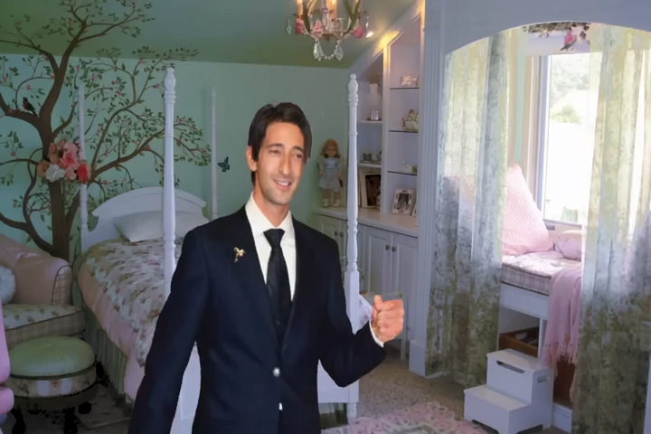

# Flow Animator

(Aka Brodyquest Animator)

Takes an input video and automatically splits it into scenes, then describes each scene using vision LLM Janus-Pro (20GB)

Meant to be paired with [kijai's CogVideoXWrapper](https://github.com/kijai/ComfyUI-CogVideoXWrapper/tree/main) implementing [Go-With-The-Flow](https://eyeline-research.github.io/Go-with-the-Flow/)

Crude workflow JSON: [V2V_CogXFlow](V2V_CogXFlow.json)

Embedded workflow image:


I recommend Pinokio "Comfy Environment Manager" for ComfyUI installation, or StabilityMatrix if you're new to ComfyUI.


# INSTALLATION
```
pip install -r requirements.txt

# optional, but recommended for quality vision LLM:
git clone https://github.com/deepseek-ai/Janus

# put your input.mp4 in the same directory as split_scenes.py
# adjust configs in each file (ALLCAPS) to taste.  Recommended 70 frames maxish for 24GB vram on cogvideoX
```

# USAGE

```
python split_scenes.py
python describe_scenes.py
```

# EXAMPLE
  
BLIND ONE-SHOT auto-parsing of *Brodyquest*.  This will work on ANY input video:
- https://github.com/dogcomplex/flow_animator
- Input video passed through ffmpeg scene detection to make clips 2s max
- then commentary prompts generated via Deepseek's Janus-Pro per-scene, analyzing every 25-max frames
- then scenes + prompts autoloaded through (ComfyUI Workflow)[https://github.com/dogcomplex/flow_animator] using [kijai's CogVideoXWrapper](https://github.com/kijai/ComfyUI-CogVideoXWrapper/tree/main).  
- output renders stitched back together by hand using Shotcut (not particularly recommended tho...), and comparison video arranged with OpenShot
- upscaled in Topaz to 1024p 24fps

